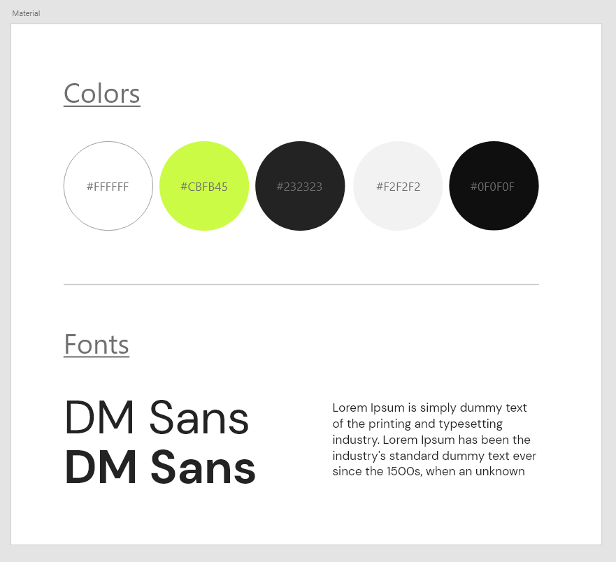
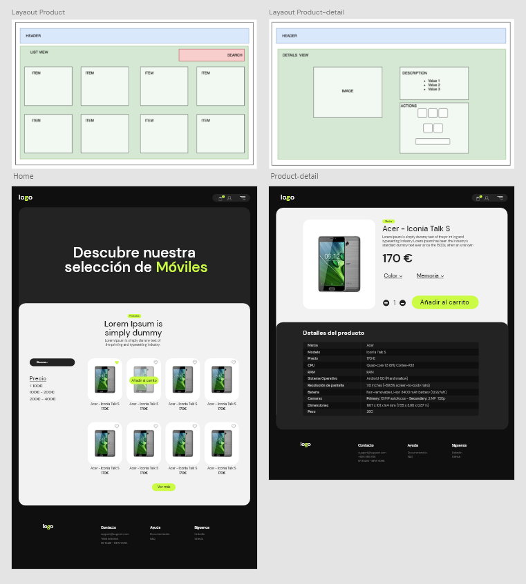

# React E-commerce API

Este proyecto es un sitio web de comercio electrónico, com productos consumidos a través de una API REST, donde puedes comprar diferentes productos relacionados con tecnología. El sitio web tiene las siguientes páginas:

- Página de inicio con todos los productos
- Página del detalle de producto
- Página de carrito
- Página de error 404

## Diseño 🔰

## Primeros pasos 🚀

Este proyecto se inició con la herramienta Vite.js

¿Por qué Vite.js?

#### Inicio Instantáneo del Server (Instant Server Start):

Nos brinda los archivos que necesitamos, atraves de módulos de javascript.

#### Rápido HMR:

Sin importar el tamaño de la aplicación, podremos ver reflejados los cambios en nuestro codebase de manera instantanea.

#### Build Optimizado:

De manera interna ya trae pre-configurado Rollup con soporte a multiples paginas y soporte para librerías.

La aplicación se ejecutará de forma predeterminada en http://localhost:5174/

### Requisitos previos 📋

Para instalar y ejecutar este software, necesitará Node.js instalado en su ordenador.

### Instalación 🔧

Para instalar las dependencias necesarias, ejecute el siguiente comando:

- mpm install

### Despliegue 📦

Para desplegar este proyecto, deberá ejecutar el siguiente comando:

- npm run start

### Construido con 🛠️

Este proyecto fue construido con las siguientes herramientas:

- Vite.js
- React
- Node.js
- SASS

### Autora ✒️

- **Jose Torres** - [88jose](https://github.com/88jose)
